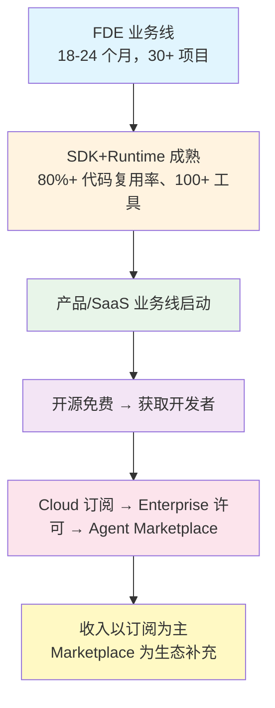
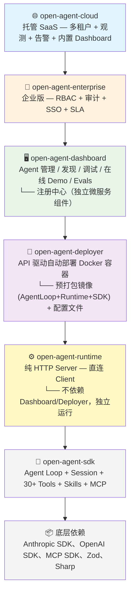
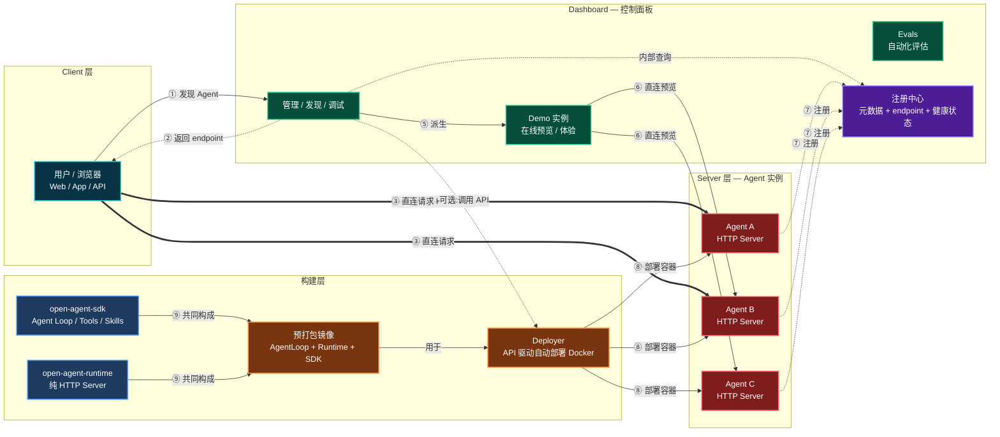
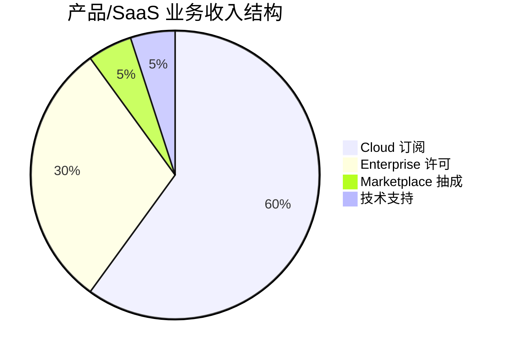
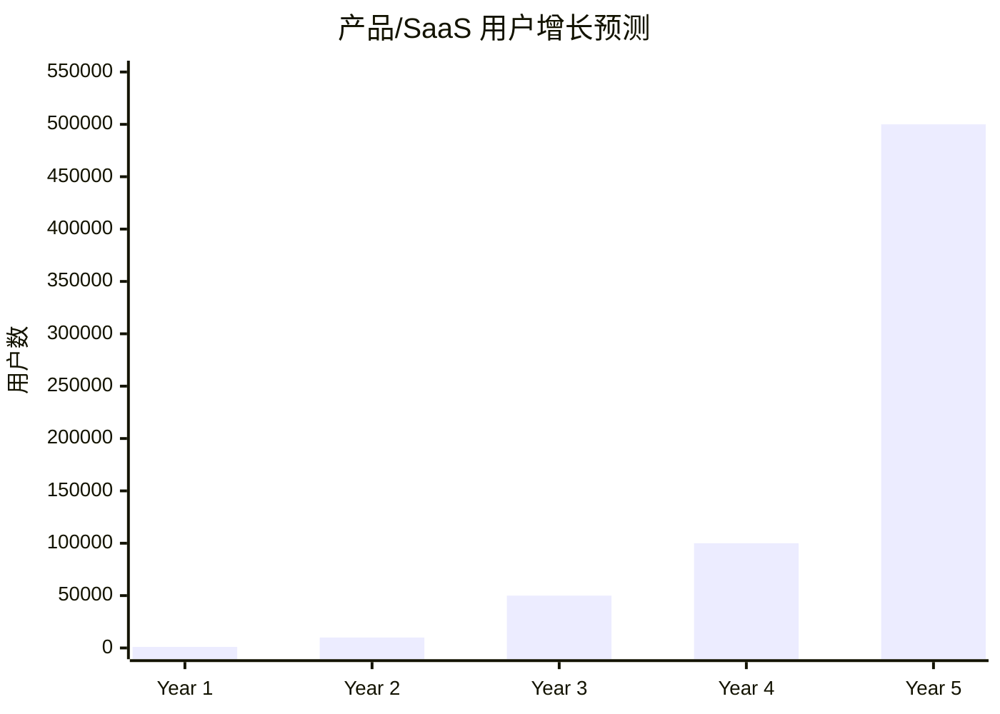
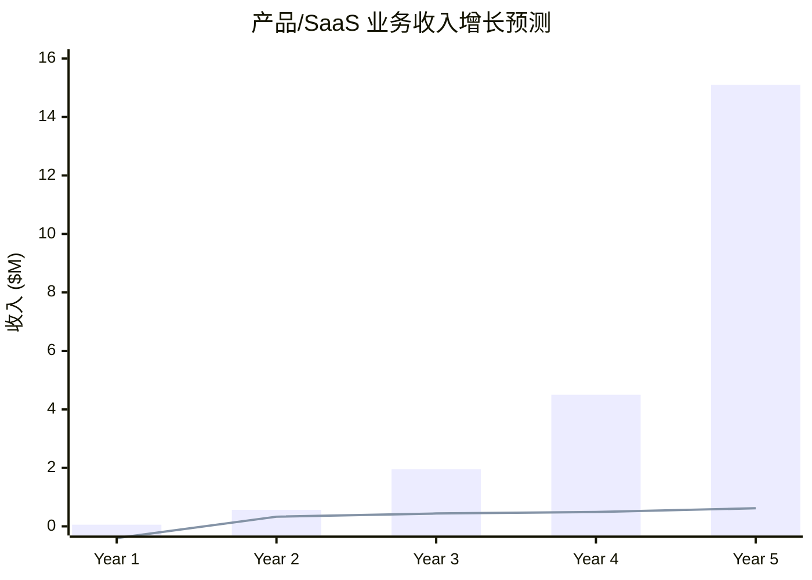
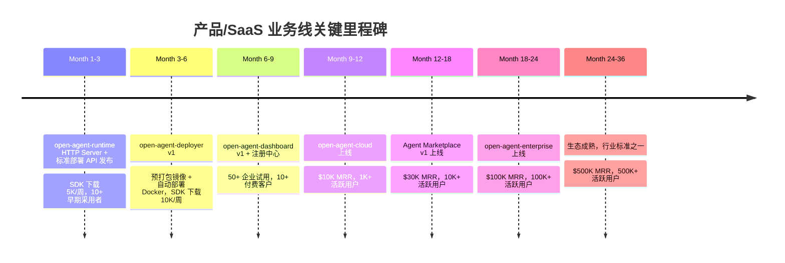
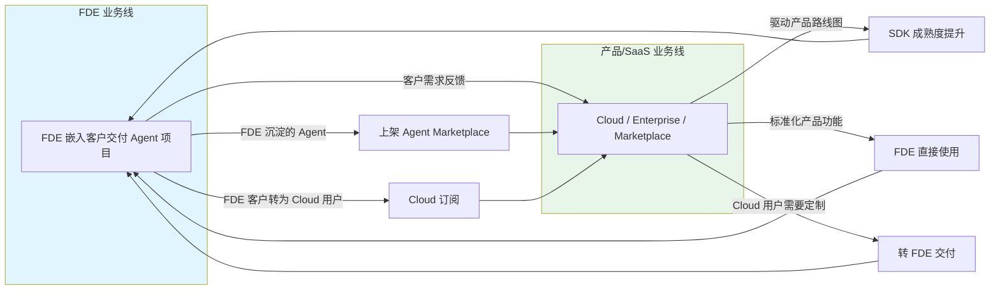

# 产品/SaaS 业务线商业计划书

**版本**：v2.1  
**日期**：2026 年 6 月  
**阶段**：规划期（FDE 跑通后启动）  

---

## 一、执行摘要

当 FDE 业务线跑通后（预计 18-24 个月），`open-agent-sdk` + `open-agent-runtime` 将经过 30+ 客户项目实战验证，SDK 成熟度达到产品化标准。此时启动**产品/SaaS 业务线**，将 SDK+Runtime 作为独立产品对外售卖或提供 SaaS 服务。

### 核心价值主张

> TS 生态中唯一一个：代码编排 Agent → 一行部署为 HTTP Server → 开箱即用的 30+ 生产级工具 + 完整 Skill 生态 + MCP 原生支持 + 23 种生命周期 Hook + FDE 实战验证 + 独立控制面板（管理/发现/调试）

### 业务逻辑

### 产品矩阵

| 产品 | 定位 | 许可 | 收费模式 |
|---|---|---|---|
| **open-agent-sdk** | 核心 SDK（Agent Loop + Session + 30+ Tools + Skills + MCP） | MIT（开源） | 免费 |
| **open-agent-runtime** | 运行时（纯 HTTP Server，直连 Client） | MIT（开源） | 免费 |
| **open-agent-deployer** | 部署器（API 驱动自动部署 Docker 容器） | MIT（开源） | 免费 |
| **open-agent-dashboard** | 控制面板（Agent 管理 / 发现 / 调试 / 在线 Demo / Evals） | MIT（开源） | 免费 |
| **open-agent-cloud** | 托管 SaaS（多租户 + 观测 + 告警 + 内置 Dashboard） | 商业 | 按量/订阅 |
| **open-agent-enterprise** | 企业版（RBAC + 审计 + SSO + SLA） | 商业 | 定制报价 |
| **Agent Marketplace** | 可部署 Agent 模板市场 | 平台抽成 | 抽成（非核心收入） |

> **Agent Marketplace 定位**：FDE 项目交付的成熟 Agent 模板沉淀为可复用的商品，用户一键安装即用。这不是一个独立的收入线，而是产品生态的自然延伸——SDK 已经支持 Agent 定义、部署、运行，Marketplace 只是给这些 Agent 提供一个分发渠道，边际成本趋近于零。

---

## 二、市场机会

### 2.1 市场规模

| 市场 | 2025 年规模 | 预测 | CAGR |
|---|---|---|---|
| Agentic AI Frameworks | $2.99B | $19.32B (2031) | 36.28% |
| Agentic AI 整体 | $6.96B | $57.42B (2031) | 42.14% |
| AI Agents | $7.63B | $182.97B (2033) | 49.6% |
| Multi-Agent Orchestration | $3.2B | $55.8B (2034) | 39.5% |
| AI Agent Platforms | $1.09B | $3.83B (2032) | 20.0% |

### 2.2 市场空白

| 现有产品 | 提供什么 | **不提供什么** | 原因 |
|---|---|---|---|
| Agno | Python AgentOS + FastAPI | TS 版本 | 官方明确 "out of scope" |
| LangGraph | Graph/DAG 编排（Python+TS） | 简单 Agent-Loop + HTTP Server | 卖 LangSmith 更赚钱 |
| Mastra | TS 全栈框架 | 生产级内置工具、Skill 生态 | 给用户 createTool，自己写 |
| OpenAI Agents SDK | TS Agent SDK | HTTP Server | 希望你用他们的 API |
| Anthropic Agent SDK | TS Agent SDK | HTTP Server | 希望你部署到他们的云端 |
| Dify | 可视化编排平台 | 代码编排 | 面向非技术用户 |
| agent-express | TS Agent Loop + HTTP | 工具生态、Skill、MCP | 只有 3 个概念，缺生态 |

**空白区**：TS 原生 + 简单 Agent-Loop + 丰富内置工具 + Skill 生态 + HTTP Server + SaaS 托管

### 2.3 目标用户

| 用户类型 | 特征 | 核心需求 | 预算 |
|---|---|---|---|
| **独立开发者** | TS 技术栈，想快速构建 AI 应用 | 极简部署、丰富工具、免费起步 | $0 - $49/月 |
| **中小企业技术团队** | 5-50 人，需要自动化工作流 | 开箱即用工具、团队协作、可观测 | $49 - $199/月 |
| **SaaS 产品团队** | 需要把 AI Agent 集成到产品 | HTTP API、高可用、多租户 | $199 - $999/月 |
| **企业 IT 部门** | 需要内部 Agent 平台 | RBAC、审计、SLA、本地部署 | $1K - $10K/月 |

---

## 三、产品定位与差异化

### 3.1 核心定位

> **TS 生态的 Agno** — 代码编排 Agent，一行部署为 HTTP Server，开箱即用的生产级工具生态

### 3.2 竞品对比

| 能力 | Open Agent SDK | Mastra | agent-express | Agno (Python) |
|---|---|---|---|---|
| Agent Loop 引擎 | ✅ 完整（auto-compact） | ✅ | ✅ | ✅ |
| HTTP Server | ✅ (Runtime 内置，直连 Client) | ✅ (Hono) | ✅ | ✅ (FastAPI) |
| **内置工具数量** | **30+ → 100+** | 0（用户自己写） | 0 | 0 |
| **Skill 生态** | **✅ 完整** | ❌ 无 | ❌ 无 | ❌ 无 |
| MCP 原生支持 | ✅ (stdio/SSE/HTTP) | ✅ | ❌ 需手动 | ❌ 需手动 |
| **Hook 系统** | **✅ 23 种生命周期** | ⚠️ Processor | ❌ 无 | ⚠️ Middleware |
| **Context 压缩** | **✅ auto-compact** | ❌ 无 | ❌ 无 | ❌ 无 |
| Cron 调度 | ✅ 内置 | ✅ (workflow cron) | ❌ 无 | ❌ 无 |
| 子 Agent 编排 | ✅ TaskTool + TeamTool | ✅ (agents 配置) | ❌ 无 | ✅ |
| 观测性 | ✅ (Phase 2) | ✅ OpenTelemetry | ❌ 无 | ✅ |
| 认证授权 | ✅ (Phase 3) | ✅ FGA + 多 provider | ❌ 无 | ✅ |
| 部署灵活性 | ✅ (Phase 3) | ✅ 多目标 | ❌ 需嵌入 | ❌ 需嵌入 |
| **FDE 实战验证** | **✅ 30+ 项目验证** | ❌ 无 | ❌ 无 | ❌ 无 |
| **概念复杂度** | **低（3 个核心概念）** | **高（15+ 概念）** | **低（3 个概念）** | **中（5+ 概念）** |

### 3.3 不可替代的差异化优势

1. **30+ → 100+ 内置生产级工具**：文件 I/O、shell 执行、web fetch、web search、MCP 资源、cron 调度、LSP、记忆、搜索、任务、团队...开箱即用
2. **完整的 Skill 生态**：可复用的 prompt 模板 + bundle 工具，文件系统扫描、注册、发现、加载、格式化注入 system prompt
3. **23 种生命周期 Hook**：PreToolUse、PostToolUse、SessionStart/End、FileChanged、TaskCreated/Completed、CronTaskFired...覆盖 Agent 全生命周期
4. **上下文压缩（auto-compact）**：生产级刚需，对话超出 token 限制时自动压缩，保持 Agent 可用
5. **极简 Agent-Loop 优先**：只有 3 个核心概念（Agent、QueryEngine、Session），用户不需要学习 graph 编排、workflow DAG、processor pipeline 等概念
6. **FDE 实战验证**：30+ 客户项目验证，SDK 成熟度经过实战检验，不是实验室产品

---

## 四、产品架构

### 4.1 产品分层

### 4.1.1 组件关系架构

### 4.2 open-agent-cloud（托管 SaaS）

| 层级 | 价格 | 包含 |
|---|---|---|
| **Free** | $0/月 | 1 Agent、100 次调用/月、基础日志、社区支持 |
| **Pro** | $49/月 | 5 Agent、10K 次调用/月、观测性、邮件支持 |
| **Team** | $199/月 | 20 Agent、100K 次调用/月、团队协作、优先级支持 |
| **Enterprise** | 定制 | 无限 Agent、无限调用、SLA、专属支持、本地部署 |

> Cloud 内置完整 Dashboard，用户无需自行部署控制面板。核心价值在于免运维 + 多租户 + SLA。

### 4.3 open-agent-dashboard（控制面板）

**定位**：独立的 Agent 管理面板，MIT 开源，可独立部署。

| 功能 | 说明 |
|---|---|
| **Agent 管理** | 创建、编辑、启停 Agent，查看配置 |
| **发现** | 通过注册中心浏览已注册的 Agent（元数据 + endpoint + 健康状态） |
| **调试** | 在线对话测试、日志查看、性能监控 |
| **在线 Demo** | 内置 Agent 预览环境，用户可直接体验 Agent 行为 |
| **Evals** | 内置 Agent 评估工具，自动化测试和基准对比 |
| **部署集成** | 调用 Deployer API 一键部署简单 Agent |

**注册中心**：Dashboard 的独立微服务组件，存储 Agent 元数据 + endpoint + 健康状态。Client 请求直连 Agent，不经过 Dashboard，Dashboard 仅用于发现和管理。

### 4.4 open-agent-deployer（部署器）

**定位**：API 驱动的自动部署产品，MIT 开源。

| 特性 | 说明 |
|---|---|
| **自动部署** | 通过 API 调用自动生成 Docker 容器 |
| **容器结构** | 预打包镜像（AgentLoop + Runtime + SDK） + 动态配置文件 |
| **默认注册** | 部署完成后自动注册到 Dashboard 注册中心 |
| **统一路径** | 简单 Agent（纯配置）和复杂 Agent（代码）均通过 Deployer 打包部署 |

### 4.5 open-agent-runtime（运行时）

**定位**：纯 HTTP Server，MIT 开源，可独立使用。

| 特性 | 说明 |
|---|---|
| **直连 Client** | 启动后直接提供服务，不依赖 Dashboard |
| **轻量纯粹** | 只做 HTTP Server 一件事，无部署逻辑 |
| **灵活部署** | 支持 `docker run` 手动启动，由 Deployer 或用户自行编排 |
| **独立运行** | 不依赖任何上层组件，可单独安装使用 |

### 4.6 open-agent-sdk

**定位**：核心 SDK，MIT 开源，Agent 能力的基石。

| 核心能力 | 说明 |
|---|---|
| **Agent Loop 引擎** | 极简 Agent 循环，auto-compact 上下文压缩 |
| **Session 管理** | 内存/SQLite/Redis/Postgres 多适配器 |
| **内置工具** | 30+ → 100+ 生产级工具（文件 I/O、shell、web fetch/search、MCP、cron、LSP、记忆、搜索、任务、团队...） |
| **Skill 生态** | 可复用的 prompt 模板 + bundle 工具，文件系统扫描/注册/发现/加载/格式化注入 system prompt |
| **MCP 原生支持** | stdio/SSE/HTTP 多传输协议 |
| **Hook 系统** | 23 种生命周期 Hook（PreToolUse、PostToolUse、SessionStart/End、FileChanged、TaskCreated/Completed、CronTaskFired...） |
| **上下文压缩** | auto-compact，生产级刚需，对话超出 token 限制时自动压缩 |
| **Cron 调度** | 内置定时任务触发 |
| **子 Agent 编排** | TaskTool + TeamTool |
| **观测性** | OpenTelemetry 集成（Phase 2） |
| **认证授权** | API Key + JWT（Phase 3） |

### 4.7 open-agent-enterprise（企业版）

| 功能 | 说明 |
|---|---|
| RBAC | 角色-based 访问控制，细粒度权限 |
| 审计日志 | 全量操作审计，合规要求 |
| SSO | SAML/OIDC 单点登录 |
| SLA | 99.9% 可用性保证 |
| 专属支持 | 专属技术支持工程师，4 小时响应 |
| 本地部署 | 支持 on-prem 部署，数据不出企业 |
| 定制开发 | 根据企业需求定制工具/Skill/Hook |

### 4.8 Agent Marketplace

**定位**：FDE 项目交付的成熟 Agent 模板沉淀为可复用的商品，用户一键安装即用。

> 这不是一个独立的收入线，而是产品生态的自然延伸。SDK 已经支持 Agent 定义、部署、运行，Marketplace 只是给这些 Agent 提供一个分发渠道，边际成本趋近于零。历史经验证明（OpenAI GPT Store、各类 Plugin Marketplace），这种模式的实际收入贡献有限，但对生态活跃度和产品粘性有正面价值。

| 角色 | 说明 |
|---|---|
| **创作者** | FDE 团队、社区贡献者发布 Agent 模板，自主定价，获得 85-90% 收入 |
| **平台** | 提供分发、支付、评价，抽成 10-15% |
| **用户** | 一键安装 Agent 模板，即装即用，可进一步定制 |

**Agent Marketplace 的形态**：
- 每个商品是一个**完整的 Agent 定义**（system prompt + 工具配置 + Skill 配置 + Hook 配置 + MCP 配置）
- 用户点击"安装"后，Agent 自动部署到用户的 Cloud 实例或本地 Runtime
- 支持预览 Agent 行为（基于 FDE 项目中的 eval 结果）
- 支持分 fork 修改，修改后的版本可以重新上架

**为什么不做 Skill/MCP Marketplace 而做 Agent Marketplace**：
- Skill 和 MCP 本质上是"零部件"，用户更愿意直接购买"完整的 Agent"
- FDE 项目的产出物天然就是 Agent，沉淀为商品是水到渠成
- Agent 商品的客单价更高，用户决策更直接
- 对 SDK 来说，Agent 就是配置文件的集合，分发成本为零

---

## 五、商业模式

### 5.1 收入来源

| 收入类型 | 说明 | 占比（预期） |
|---|---|---|
| **Cloud 订阅** | SaaS 托管服务订阅费 | 60% |
| **Enterprise 许可** | 企业版许可费 | 30% |
| **Marketplace 抽成** | Agent 交易抽成 | **5%（生态补充，非核心收入）** |
| **技术支持** | 专属技术支持服务 | 5% |

> **收入结构说明**：核心收入来自 Cloud 订阅和 Enterprise 许可，占比 90%+。Marketplace 抽成占比控制在 5% 以内，定位为生态补充——它的价值在于丰富产品生态、提高用户粘性、促进 FDE 项目沉淀，而不是独立创收。

### 5.2 定价策略

#### open-agent-cloud

| 层级 | 月费 | 年费（省 20%） | 包含 |
|---|---|---|---|
| Free | $0 | $0 | 1 Agent、100 次/月、基础日志 |
| Pro | $49 | $470 | 5 Agent、10K 次/月、观测性 |
| Team | $199 | $1,910 | 20 Agent、100K 次/月、团队协作 |
| Enterprise | 定制 | 定制 | 无限 Agent、无限调用、SLA |

#### open-agent-enterprise

| 功能包 | 价格 | 说明 |
|---|---|---|
| 基础版 | $250/月 | RBAC、审计日志、SSO、邮件支持 |
| 专业版 | $1,000/月 | 基础版 + SLA、专属支持、优先响应 |
| 旗舰版 | 定制 | 专业版 + 本地部署、定制开发、架构咨询 |

#### Agent Marketplace 抽成

| 交易类型 | 平台抽成 | 创作者分成 |
|---|---|---|
| Agent 模板销售 | 15% | 85% |
| 月销售额 > $5K | 10% | 90% |

> Marketplace 定价策略以低抽成为原则，鼓励创作者贡献内容，平台不以 Marketplace 为主要收入来源。

---

## 六、财务预测

### 6.1 用户增长预测

| 年份 | 活跃用户 | Cloud 订阅用户 | Enterprise 客户 | Marketplace Agent 数 |
|---|---|---|---|---|
| **Year 1** | 1,000 | 50 | 5 | 20 |
| **Year 2** | 10,000 | 500 | 20 | 100 |
| **Year 3** | 50,000 | 2,000 | 50 | 300 |
| **Year 4** | 100,000 | 5,000 | 100 | 500 |
| **Year 5** | 500,000 | 20,000 | 200 | 1,000 |

### 6.2 收入预测

| 年份 | Cloud 订阅 | Enterprise | Marketplace | 技术支持 | 总收入 |
|---|---|---|---|---|---|
| **Year 1** | $30K | $15K | $2K | $10K | $57K |
| **Year 2** | $300K | $200K | $15K | $50K | $565K |
| **Year 3** | $1.2M | $600K | $50K | $100K | $1.95M |
| **Year 4** | $3M | $1.2M | $100K | $200K | $4.5M |
| **Year 5** | $12M | $2.4M | $200K | $500K | $15.1M |

> **Marketplace 收入说明**：Marketplace 抽成收入占比逐年下降（Year 1: 3.5% → Year 5: 1.3%），反映核心业务（Cloud + Enterprise）的快速增长，以及 Marketplace 作为生态补充的定位。

### 6.3 成本结构

| 成本类型 | 占比 | 说明 |
|---|---|---|
| **云基础设施** | 30-40% | 托管服务、计算资源、存储、带宽 |
| **人员成本** | 30-40% | 产品开发、运维、技术支持、市场 |
| **市场营销** | 10-15% | 社区运营、会议、内容营销、广告 |
| **法律/合规** | 5-10% | 知识产权、合同、合规审查 |
| **预留资金** | 5-10% | 风险缓冲、机会投资 |

### 6.4 利润预测

| 年份 | 收入 | 成本 | 毛利 | 毛利率 |
|---|---|---|---|---|
| **Year 1** | $57K | $80K | -$23K | -40% |
| **Year 2** | $565K | $380K | $185K | 33% |
| **Year 3** | $1.95M | $1.1M | $850K | 44% |
| **Year 4** | $4.5M | $2.3M | $2.2M | 49% |
| **Year 5** | $15.1M | $5.8M | $9.3M | 62% |

**Year 1 亏损逻辑**：产品初期需要投入基础设施和人员成本，用户基数小，收入不足以覆盖成本。这是 SaaS 产品的典型特征。

---

## 七、产品路线图

### Phase 1（0-3 个月）— open-agent-runtime HTTP Server

| 功能 | 说明 | 优先级 |
|---|---|---|
| `AgentRouter` | SSE 流式对话、Session CRUD | P0 |
| Session Store | 内存 + SQLite 适配器 | P0 |
| Health + Metrics | 健康检查、Token 统计 | P0 |
| CLI 基础 | `open-agent start/stop/status` | P1 |
| 配置文件 | `.yaml` 配置加载 | P1 |

### Phase 2（3-6 个月）— 守护进程 + Deployer

| 功能 | 说明 | 优先级 |
|---|---|---|
| `DaemonManager` | PM2 集成、优雅重启、日志管理 | P0 |
| Redis/Postgres Store | 高可用 Session 存储 | P0 |
| **open-agent-deployer v1** | API 驱动自动部署 Docker 容器 | P0 |
| **预打包镜像** | AgentLoop + Runtime + SDK 统一镜像 | P0 |
| OpenTelemetry | Tracing + Metrics + Logs | P1 |
| 认证 | API Key 认证、JWT 支持 | P1 |

### Phase 3（6-12 个月）— Dashboard + 观测性

| 功能 | 说明 | 优先级 |
|---|---|---|
| **open-agent-dashboard v1** | Agent 管理 / 发现 / 调试 | P0 |
| **注册中心** | 独立微服务组件，存储 Agent 元数据 + endpoint | P0 |
| **在线 Demo** | Agent 预览环境 | P1 |
| 多目标部署 | Vercel/Cloudflare/Docker/K8s | P0 |
| RBAC | 角色-based 访问控制 | P1 |
| Agent Marketplace v1 | Agent 模板市场（基础版，低抽成） | P2 |
| A2A 协议 | 跨框架 Agent 互操作 | P2 |

### Phase 4（12-18 个月）— 开放 SaaS

| 功能 | 说明 | 优先级 |
|---|---|---|
| open-agent-cloud 上线 | 多租户托管服务 | P0 |
| 自助注册/支付 | 用户自助开通、支付、管理 | P0 |
| 计费系统 | 按量计费、订阅计费、发票 | P0 |
| 客户支持系统 | 工单、知识库、社区论坛 | P1 |

### Phase 5（18-24 个月）— 企业版 + Marketplace

| 功能 | 说明 | 优先级 |
|---|---|---|
| open-agent-enterprise 上线 | 企业版产品 | P0 |
| SSO 集成 | SAML/OIDC 单点登录 | P0 |
| 审计日志 | 全量操作审计 | P0 |
| SLA 支持 | 99.9% 可用性保证 | P1 |
| 本地部署支持 | on-prem 部署方案 | P1 |
| Agent Marketplace v2 | Agent 模板市场（完整版，含评价/fork） | P2 |

---

## 八、市场策略

### 8.1 开发者获取

| 渠道 | 策略 | 目标 |
|---|---|---|
| **GitHub** | 开源 SDK + Runtime + Dashboard + Deployer，Star 增长 | Year 1: 1K+, Year 3: 5K+, Year 5: 20K+ |
| **npm** | 发布 npm 包，周下载量增长 | Year 1: 1K/周, Year 3: 10K/周, Year 5: 50K/周 |
| **技术博客** | 发布技术深度文章、FDE 案例 | 每月 2-4 篇 |
| **社区运营** | Discord/Slack、技术会议 | Year 1: 500+ 成员, Year 3: 5K+ 成员 |
| **文档站** | 完善文档、教程、示例 | 21+ 示例 → 100+ 示例 |

### 8.2 商业客户获取

| 渠道 | 策略 | 目标 |
|---|---|---|
| **FDE 客户转化** | FDE 客户转为 Cloud/Enterprise 用户 | Year 2: 30%+ 转化率 |
| **直销团队** | 面向大客户的直销 | Year 2: 5 人团队 |
| **合作伙伴** | 云厂商、咨询公司、系统集成商 | Year 2: 10+ 合作伙伴 |
| **口碑传播** | 客户案例、推荐奖励 | Year 2: 20%+ 新客户来自推荐 |

### 8.3 品牌建设

| 活动 | 说明 | 频率 |
|---|---|---|
| **技术会议** | 参加/赞助 AI、TS 相关会议 | 每季度 1-2 次 |
| **网络研讨会** | 在线技术分享、产品演示 | 每月 1 次 |
| **案例研究** | FDE 客户案例发布 | 每季度 2-3 篇 |
| **开源贡献** | 鼓励社区贡献，维护开源项目 | 持续 |

---

## 九、风险与应对

### 9.1 市场风险

| 风险 | 影响 | 应对 |
|---|---|---|
| **Mastra 增加内置工具** | 削弱差异化优势 | 持续深化 Skill 生态和 Hook 系统，建立社区壁垒 |
| **OpenAI/Anthropic 提供 HTTP Server** | 直接竞争 | 保持模型无关性，聚焦多模型 + 多工具生态 |
| **TS 生态出现新竞品** | 市场份额被蚕食 | 快速迭代，建立社区和品牌忠诚度 |
| **AI Agent 市场增速放缓** | 收入不及预期 | 拓展传统企业 IT 自动化市场 |

### 9.2 技术风险

| 风险 | 影响 | 应对 |
|---|---|---|
| **模型 API 变更** | Agent 行为异常 | 模型无关设计，快速适配 |
| **安全问题** | 数据泄露、越权 | 权限控制、审计日志、合规审查、安全测试 |
| **性能瓶颈** | 高并发不稳定 | 压力测试、水平扩展、缓存优化、CDN |
| **核心开发者流失** | 开发进度受阻 | 建立文档化开发流程，培养社区贡献者 |

### 9.3 商业风险

| 风险 | 影响 | 应对 |
|---|---|---|
| **云基础设施成本过高** | 利润率低 | 优化架构，使用 serverless，按需扩展 |
| **用户付费意愿低** | 收入不及预期 | 提供免费层级，展示付费价值，逐步引导 |
| **开源协议变更风险** | 商业化法律风险 | 采用 MIT + 商业版双许可模式 |
| **FDE 业务线反哺不足** | SDK 成熟度不够 | 建立反馈机制，定期从 FDE 项目提取需求 |

---

## 十、关键里程碑

---

## 十一、与 FDE 业务线的协同

### 11.1 FDE 业务线回顾

FDE（Forward Deployed Engineer，前沿部署工程师）是我们的**启动引擎**：
- FDE 工程师嵌入客户环境，用 SDK+Runtime 交付定制化 Agent 项目
- 客户需求反哺 SDK 成熟，形成飞轮效应
- 24 个月内完成 30+ 项目交付，SDK 复用率>80%

### 11.2 协同机制

### 11.3 协同价值

| 协同点 | 价值 |
|---|---|
| **FDE 客户 → Cloud 用户** | FDE 客户需要持续服务时，转为 Cloud 订阅用户（Year 2 预计 30% 转化率） |
| **Cloud 用户 → FDE 客户** | Cloud 用户需要定制开发时，转 FDE 交付（Year 2 预计 10% 转化率） |
| **FDE Agent → Marketplace** | FDE 项目交付的成熟 Agent 模板，标准化后上架 Marketplace（零边际成本） |
| **Marketplace Agent → FDE 交付** | FDE 项目直接使用 Marketplace Agent 作为起点，加速交付 |
| **需求反哺** | FDE 和 Cloud 用户的需求，共同反哺 SDK 成熟 |

### 11.4 协同指标

| 指标 | Year 2 | Year 3 | Year 4 | Year 5 |
|---|---|---|---|---|
| FDE → Cloud 转化率 | 30% | 40% | 50% | 60% |
| Cloud → FDE 转化率 | 10% | 15% | 20% | 25% |
| FDE 沉淀为 Marketplace Agent 数 | 10 | 50 | 100 | 200 |
| 定制需求产品化率 | 20% | 40% | 60% | 80% |

---

## 十二、结论

产品/SaaS 业务线是我们的**长期增长引擎**：当 FDE 业务线跑通后，SDK+Runtime 经过 30+ 客户项目实战验证达到成熟标准，此时启动产品/SaaS 业务线，将 SDK+Runtime 作为独立产品对外售卖或提供 SaaS 服务。这是一个**高增长、高毛利**的长期业务线，因为：

1. **市场空间巨大**：Agentic AI Frameworks 市场 2025-2031 年 CAGR 36.28%
2. **差异化明显**：TS 生态中唯一同时具备极简 Agent-Loop + 丰富内置工具 + Skill 生态 + 独立控制面板 + FDE 实战验证的产品
3. **商业模式清晰**：核心收入来自 Cloud 订阅（60%）和 Enterprise 许可（30%），Agent Marketplace 为生态补充（5%）
4. **与 FDE 业务线协同**：双向导流、需求反哺、资源共享
5. **Agent Marketplace 是自然延伸**：FDE 项目沉淀的 Agent 模板直接上架，边际成本为零，历史经验证明市场模式收入有限，但对生态有正面价值

产品/SaaS 业务线成功的关键指标：**24 个月内达到 $100K MRR，100K+ 活跃用户，成为 TS 生态 Agent 框架标准之一**。

---

## 附录：竞品融资参考

| 公司 | 融资轮次 | 金额 | 时间 | 投资者 |
|---|---|---|---|---|
| **Mastra** | Series A | $22M | 2026-04 | Spark Capital |
| **Mastra** | Seed | $13M | 2025-10 | YC, Gradient, 100+ 天使 |
| **Dify** | Series A | 未公开 | 2024 | 红中国等 |
| **LangChain** | Series A | $25M | 2023 | Sequoia, Benchmark |
| **LangChain** | Seed | $10M | 2023 | Benchmark, First Round |
| **Agno** | 未融资 | - | - | 开源项目 |

**参考估值**：Mastra（$35.5M 融资，24K stars，30 万周下载）估值约 $150M-$200M。Open Agent SDK 达到同等指标时，估值可达 $100M-$150M。
